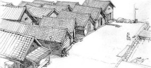

# Pinus - A Ilha Pinheiro
<!--  -->
> **Regente:** Lou Devole, humano, 85 anos.
> Devole foi escolhido por Annain para reger Pinus, a capital do reino, por ser filho direto de Noer Dhakar, o mago adivinho. Sua vida, desde os sete anos foi apenas obedecer a ordens diretas dos deuses para manter a cidade viva. Há 78 anos ele rege a cidade, e é conhecido por todos como “A voz de An’n”.

> **Guildas e Organizações:** Uma grande cidade atrai muitos ladinos e ostentadores de vida fácil. E isso com certeza atraiu Wild Bill Hicup, o gnomo líder e fundador do clã Raposa. A sede do maior clã de ladinos de Solaris não poderia estar em lugar melhor. Se você é ladino, e não pertence ao clã Tigre, é bem vindo.

Governada há anos pelos Humanos, a Ilha Pinheiro é o centro entre os dois continentes principais de Solaris, Goniar e Tubniar.

Muito visitada pelos comerciantes, devido a sua privilegiada localização, é habitada por representantes de todas as raças existentes. Sobre sua superfície, flutua An’n a cidade dos deuses, criada por Annain, deusa patrona da cidade.

## História

A história mais plausível sobre a criação da Ilha é de como ela surgiu da sombra de An’n a cidade dos deuses. Uma lenda, contada através de várias gerações, e enfim confirmada por Noer Dhakar, o mago adivinho de 3ª geração.

An’n, diferente de toda Solaris, não pertence ao corpo de Nahn. Essa ilha flutua sobre solaris, observando sua contínua linha do tempo, e cuidando que nada seja esquecido. Os anjos residentes em An’n são escribas de Onainahaback. Escrevem toda história de Solaris em um livro, sem perder um parágrafo sequer.

O que acontece, é que a sombra de An’n faz surgir uma ilha da mesma forma. De simetria perfeita, que somente os deuses poderiam fazê-la. Assim nasce a Ilha Pinheiro.

A habitação nessa ilha se deu por volta da era fria, quando Jhakar e Jedil tiveram seu primeiro filho. O único ponto estável de Solaris era à sombra de An’n. O que fez com que várias espécies a procurassem como refúgio.

## Clima e Terreno

A Ilha Pinheiro, é basicamente uma ilha tropical. Apesar de ilha, sua parte central fica a 100m do nível do mar, ainda assim afastada de An’n. Mas não o suficiente para impedir a luminosidade solar. Pinus, a cidade capital, é escura, e só recebe a luz solar uma vez a cada seis anos, devido a um fenômeno gravitacional que faz com que An’n se afaste alguns metros. Da mesma forma, não são afetados por chuva ou qualquer outra variação climática, mesmo nos dias atuais, em que o mundo sofre com a segunda era fria.

## Fronteiras

É localizada exatamente no centro conhecido de Solaris. Ao sudeste se encontra o continente de Tubniar e a noroeste Goniar. Os mares de nordeste e sudeste são desconhecidos.

## População

Em sua pequena maioria humanos. Mas encontramos representantes de todas as raças sociáveis conhecidas de Solaris. Elfos e Sátiros são raros. Esses últimos a muito não são vistos.

## Cidades

A Ilha Pinheiro como reino centraliza sua população em Pinus, a cidade capital. Porém outras pequenas cidades foram se formando em direção a costa. Essas que duram pouco tempo, devido à falta de recursos na ilha. Mesmo com a sombra da cidade dos deuses, a ilha é improdutiva para qualquer tipo de plantio. Ao que parece, apenas algumas árvores sem valor nascem no seu infértil solo. Muitos acreditam que, como não faz parte do corpo de Nahn, a Ilha Pinheiro não recebe o “soro da vida”.

## Outros Pontos de Interesse

Além de seu humilde castelo, Pinus ainda conta com os seguintes pontos a serem visitados:
* **Taverna do Lou:** uma das tavernas mais famosas de toda Solaris, tem em seu centro uma estátua do regente de Pinus talhada em madeira sustentando o segundo andar onde ficam os dormitórios. Frequentada por caçadores de recompensas e comerciantes em geral, é um ótimo lugar para se obter a informação que procura.

* **O Observatório:** um dos pontos mais interessantes de Pinus com certeza é seu observatório. Construído antes da primeira era fria, a estrutura chega a ter por volta dos 54m de altura. Seus 18 andares foram construídos com a tentativa de alcançar a cidade flutuante dos deuses. Sem sucesso o projeto foi abandonado inacabado. Hoje a torre tem uma inclinação de 20°. E é graças a essa inclinação que a cada 6 anos os habitantes de Pinus podem contemplar o milagre do sol.

* **A Grande Feira:** se você procura por uma espada que revigore suas forças durante o uso, pode começar procurando por aqui! Sim, a Grande Feira reúne basicamente todos os comerciantes de Solaris duas vezes por ano. Esses comerciantes vindos de todos os cantos trazem iguarias e artefatos raríssimos. Mas é claro que isso custa muitas peças de ouro, o que deixa a feira conhecida por seus altos preços.

* **Castelo de Pinus:** e porque não conhecer Lou Devoule em sua visita a Pinus? Apesar de ser o principal regente de toda Solaris, Lou não ostenta de um castelo ornamentado a ouro (como Rei Autolycus de Ludwig), mas sim de, como costuma chamar, uma humilde capela. Construído para adoração de Annain, o castelo de Pinus mais se parece com um templo do que com um castelo. Mas mesmo assim não deixa de impor seu poder a toda Solaris. Afinal, qual outro regente é capaz de comunicar-se diretamente com os escribas dos deuses?